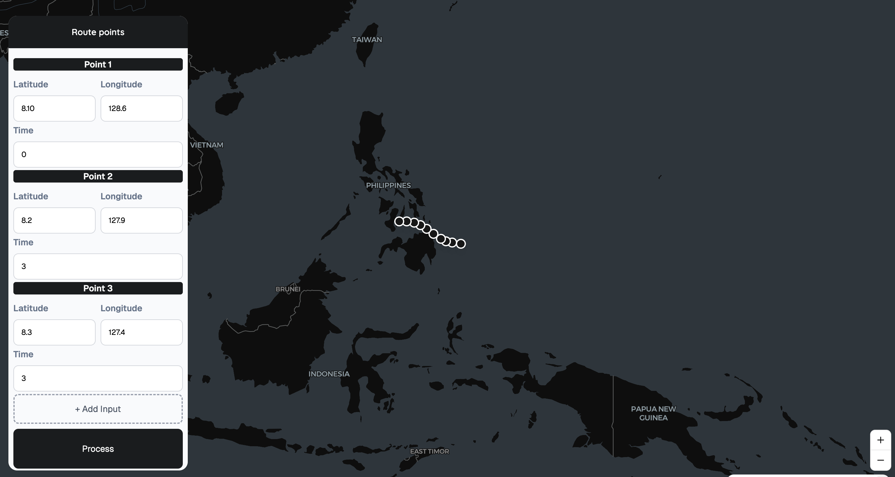
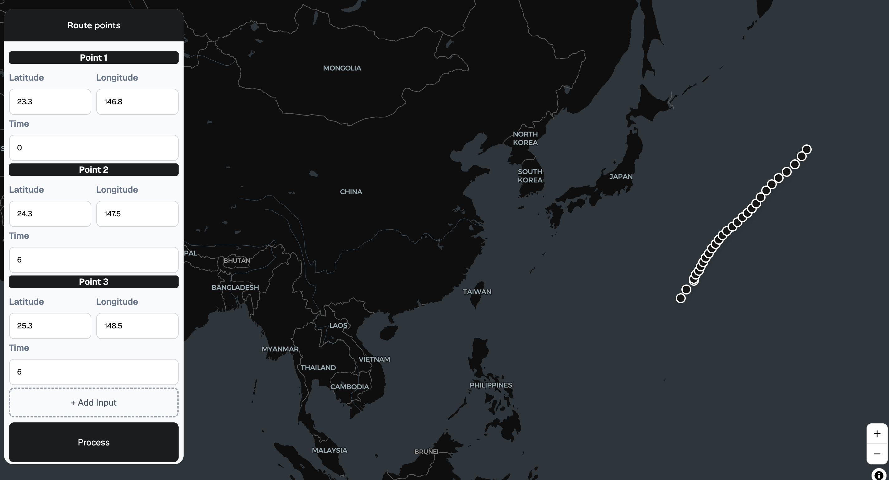

# 📊 Prediction App

A full-stack application that predicts typhoon tracks outcomes based on historical data on previous typhoons using K-Nearest Neighbor
Dataset used is from the International Best Track Archive for Climate Stewardship (IBTrACS)
---

## 🚀 Overview

This project is a web-based prediction system that allows users to input data and receive a computed prediction result.  
It combines a **React frontend** with a **Python (FastAPI) backend**, making it fast, interactive, and scalable.

## 🛠️ Tech Stack

**Frontend:**
- React
- JavaScript
- CSS / Tailwind

**Backend:**
- Python
- FastAPI
- NumPy / Scikit-learn

## 📸 Preview

### Prediction for typhoon Sinlaku

### Random input
